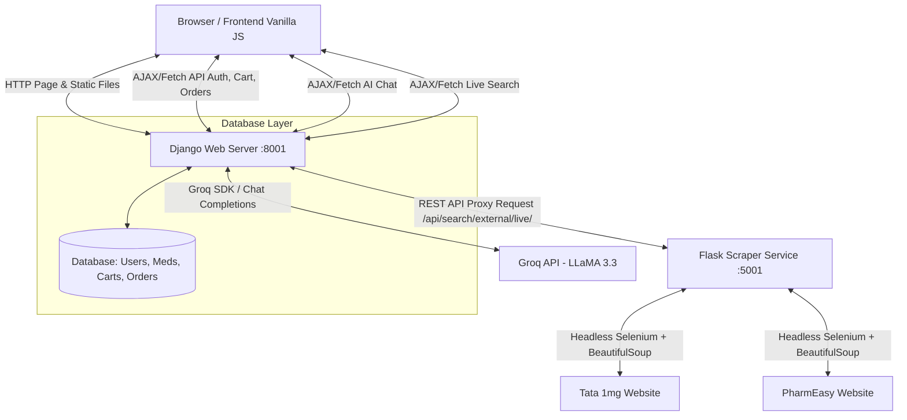

# NeuroVaidya: Technical Architecture & System Walkthrough

This document provides a comprehensive, in-depth explanation of the **NeuroVaidya** online pharmacy platform's system architecture, backend logic, frontend integration, and external service integrations. It is designed to serve as a thorough reference for your interview preparation.

---

## 1. High-Level Architecture Overview

NeuroVaidya is split into three main architectural layers:
1. **Django Backend (Main Server):** Serves the web application, manages database operations (PostgreSQL/SQLite), handles authentication, orders, cart state, and proxies requests to external services.
2. **Flask Scraper Service:** A standalone microservice running on port `5001` that utilizes automated headless Selenium WebDrivers to scrape live pricing and availability from external e-commerce medical portals (Tata 1mg & PharmEasy).
3. **Neuro AI Copilot (LLM):** Integrates the Groq API (running `llama-3.3-70b-versatile`) to act as a medical assistant, responding to patient wellness and drug questions.

### System Interaction Diagram



---

## 2. Django Backend Deep Dive

The Django backend is structured using **Django REST Framework (DRF)** for APIs and traditional Django views/templates for serving frontend pages.

### A. Database Models (`models.py`)

#### 1. Custom User Model (`users.models.User`)
Inherits from Django's `AbstractUser` to support custom profile configurations:
* **`role`**: Defines user privilege levels (`patient`, `pharmacist`, `admin`).
* **Profile Fields**: Pincode, address, city, state, phone, and avatar.
* **Verification Fields**: GST number, drug license, and verification flag (`is_verified`) for pharmacy vendors.
* **Online Status**: `is_online` and `last_seen` flags.

#### 2. Medicine Catalog (`medicines.models.Medicine` & `Category`)
* **`Category`**: Holds category classifications (e.g., Ayurveda, OTC, etc.).
* **`Medicine`**: Represents the platform's local products:
  * **Pricing**: MRPrice, selling price, and discount percentage.
  * **Distributor**: Foreign Key linking to a `User` with a `distributor` or `admin` role.
  * **Metadata**: Composition, dosage form, package size, stock quantity, and manufacturer.
  * **Prescription Flag**: `requires_prescription` (requires an uploaded medical prescription to purchase).

#### 3. Shopping Cart (`orders.models.Cart` & `CartItem`)
* **`Cart`**: Linked to a user via `OneToOneField`. Evaluates calculations dynamically:
  * `subtotal`: Sums the subtotal of all active cart items.
  * `discount_amount`: Calculated from an active `Coupon` model if applied.
  * `total_amount`: Subtotal minus discount.
* **`CartItem`**: Bridges `Cart` and `Medicine` models with a `quantity` attribute.

#### 4. Orders & Order Items (`orders.models.Order` & `OrderItem`)
* **`Order`**: Captures checkout snapshots:
  * Auto-generates unique `order_number` (e.g., `NV` + 8 character UUID hex).
  * Status Trackers: Order Status (`pending`, `confirmed`, `shipped`, `delivered`, `cancelled`) and Payment Status (`pending`, `paid`, `failed`).
  * Preservation: Stores delivery contact data and total pricing points.
  * Prescription uploads: `prescription` field for saving medical script images.
* **`OrderItem`**: Saves the specific product details (such as price and name) at the exact moment of order completion to prevent issues if catalog items are later deleted or updated.

---

### B. Core API Workflows & The Dynamic Catalog Bridge

The backend manages operations through DRF `APIView` classes:
* **Cart Operations**: `CartView` (fetching user carts), `AddToCartView`, and `UpdateCartItemView`.
* **Checkout Operations**: `CheckoutView` wraps database updates in a `@transaction.atomic` block:
  1. Validates delivery details.
  2. Creates the `Order` object.
  3. Loops through cart items, generating corresponding `OrderItem` records.
  4. Deducts purchased quantities from the `Medicine` stock database.
  5. Clears the user's `Cart` and removes any applied coupons.

#### 💡 Key Feature: The Dynamic Catalog Bridge (`AddExternalToCartView`)
A major highlight of the architecture is how external scraped medicines are added to the user's shopping cart:
1. When a user clicks **"Add to Cart"** on an external live market product card (scraped from Tata 1mg or PharmEasy), the frontend issues a `POST` request to `/api/orders/cart/external/add/`.
2. The endpoint receives details like `name`, `price`, `mrp`, `source_site`, and `image_url`.
3. In the backend, Django uses `Medicine.objects.get_or_create(...)` to dynamically create a local database record for this medicine:
   ```python
   medicine, created = Medicine.objects.get_or_create(
       name=name,
       manufacturer=source_site,
       defaults={
           'price': price_val,
           'mrp': mrp_val,
           'distributor': default_distributor_user,
           'description': image_url,
           'stock': 999,  # Default stock for external fulfillment
           'is_active': True,
       }
   )
   ```
4. This allows the backend to handle the scraped product like any other database product, letting users checkout and process orders through the same flow.

---

## 3. Frontend Integration & Caching Layer

The frontend uses Django templates to serve server-side structured layouts (`base.html`, `catalog.html`), styled with vanilla CSS (featuring a dark mode theme). Client-side logic is driven by Vanilla JavaScript.

### A. Dual Search Workflow (`templates/catalog.html`)
The search page runs a dual-path search operation for maximum catalog coverage:
1. **Local Search:** Filters locally cached medicines inside the browser using JavaScript's `.filter()` method for immediate response.
2. **Live Market Search:** For search queries longer than 2 characters, the script appends a "Live Market Results" section and runs a fetch call:
   `fetch('/api/search/external/live/?q=query')`
3. **The Django Proxy Role:** The Django view (`LiveMarketSearchView` in `search/views.py`) acts as a proxy, passing the query to the Flask scraping service (`http://127.0.0.1:5001/api/search?q=query`).
4. **Result Rendering:** Once the JSON response returns, JavaScript dynamically renders the cards, applying a green border to indicate they are live external options.

### B. High-Performance Caching Layer (Double-Grip Cache)
To keep search fast and prevent scraper rate-limiting, NeuroVaidya uses a double caching layer:

```
[User Search] 
      │
      ├──> [Layer 1: Browser LocalStorage Cache] (Exp. 4 hours)
      │         Found? => Render instantly
      │         Miss?  => Query Django API
      │
      └──> [Layer 2: Flask In-Memory Scraper Cache] (Exp. 1 hour)
                Found? => Return cached JSON
                Miss?  => Spin up Selenium WebDrivers to scrape live sites
```

1. **Frontend LocalStorage Cache:** JavaScript checks `localStorage` first:
   * Key format: `search_cache_{query}`.
   * If the cache entry is less than 4 hours old, it parses the JSON and renders the results instantly.
2. **Backend Flask Cache:** If the request misses the browser cache, it goes to the Flask API. Flask checks its in-memory python dictionary (`_CACHE`) using a 1-hour expiry before running any scraping logic.

---

## 4. LLM & Neuro AI Integration (`search/views.py`)

Neuro AI acts as a dedicated chat copilot, accessible from a sliding sidebar layout present on every page of the website.

### A. Groq API Integration
The chatbot relies on the `groq` client SDK, calling the **`llama-3.3-70b-versatile`** model.
1. The Django endpoint `AIChatView` intercepts `POST` prompts.
2. It fetches the `GROQ_API_KEY` from the system's environment variables.
3. The prompt is packaged and sent to Groq with strict formatting instructions:
   ```python
   result = client.chat.completions.create(
       model="llama-3.3-70b-versatile",
       messages=[
           {"role": "system", "content": NEURO_AI_SYSTEM_PROMPT},
           {"role": "user", "content": prompt},
       ],
       max_tokens=512,
       temperature=0.7,
       top_p=0.95,
   )
   ```

### B. System Prompt Design (`NEURO_AI_SYSTEM_PROMPT`)
To keep responses medically focused and safe, the model is configured with a strict system instruction:
> "You are Neuro AI, a knowledgeable and caring medical assistant for NeuroVaidya, an online pharmacy platform. You help users with health questions, medicine information, dosage guidance, side effects, and general wellness advice. Always remind users to consult a doctor for serious conditions. Keep answers concise, helpful, and easy to understand. If asked about something non-medical, politely redirect to health topics."

### C. Chat UI & UX Integration (`templates/base.html`)
* **State Preservation:** Conversation history is saved in `sessionStorage` (`neuroai_chat`) along with the sidebar's open/closed state (`neuroai_open`), ensuring the chat doesn't close or reset when users navigate between pages.
* **Micro-Animations:** A custom pulsing orange light (`.neuro-ai-pulse`) glows on the navigation bar button to draw attention, and a simulated message bubble with pulsing dots (`.nv-typing-dot`) shows when the AI is processing a reply.

---

## 5. Medicine Scraper Service Deep Dive

The scraping microservice is written in **Flask** (`medicine_scraper/app.py`) and is designed for stability and stealth execution.

### A. Key Libraries Used
1. **Flask & Flask-CORS:** Lightweight framework to build search endpoints, making it easy to connect with Django.
2. **Selenium (WebDriver):** Necessary because target e-commerce platforms (Tata 1mg, PharmEasy) serve content as dynamic Single Page Applications (SPAs). Selenium automates a real Chrome browser instance to fetch pages after all JavaScript has fully executed.
3. **BeautifulSoup4 (BS4) & `lxml`:** Once Selenium fetches the page source, BS4 uses the fast `lxml` parser to extract details like name, price, discount, and images from the HTML tree.
4. **Webdriver Manager (`webdriver_manager`):** Automatically downloads and configures the correct ChromeDriver binaries, eliminating manual setup issues across different OS environments.
5. **Concurrent Futures (`concurrent.futures`):** Runs the scrapers in parallel during local development to speed up searches.

---

### B. Stealth Selenium Configurations (`scraper_base.py`)
To prevent target websites from blocking request traffic, `BaseScraper` applies several automation bypass settings:

```python
options = Options()
options.add_argument("--headless=new")  # Modern headless Chrome mode
options.add_argument("--no-sandbox")
options.add_argument("--disable-dev-shm-usage")
options.add_argument("--disable-gpu")
options.add_argument("--disable-blink-features=AutomationControlled") # Hides automation control flags
options.add_experimental_option("excludeSwitches", ["enable-automation"])
options.add_experimental_option("useAutomationExtension", False)

# Custom User-Agent to match real human browsers
user_agent = "Mozilla/5.0 (Windows ... Chrome/122.0.0.0 Safari/537.36"
options.add_argument(f"user-agent={user_agent}")
```

Additionally, it executes a CDP (Chrome DevTools Protocol) script to override the `navigator.webdriver` property to `undefined`, hiding the automation flag:
```python
self.driver.execute_cdp_cmd("Page.addScriptToEvaluateOnNewDocument", {
    "source": "Object.defineProperty(navigator, 'webdriver', {get: () => undefined})"
})
```

---

### C. Performance & Resource Optimization
Headless browsers consume significant memory, which can lead to crashes in resource-constrained environments like Render. The microservice uses these strategies to optimize resource usage:
1. **Image Blocking:** Tells Chrome not to load images to save network bandwidth and memory:
   ```python
   prefs = {"profile.managed_default_content_settings.images": 2}
   options.add_experimental_option("prefs", prefs)
   ```
2. **Pre-Warming WebDriver (`warmup_scrapers`):** Instantiates the ChromeDriver on application startup rather than waiting for the user's first search query, avoiding an initial 10-20 second latency.
3. **Smart Execution Modes:** 
   * **Local Environment:** Runs scrapers in parallel using `ThreadPoolExecutor` for quick results.
   * **Production/Render Environment:** Detects `RENDER=true` and runs scrapers sequentially to stay within platform memory limits.
4. **Garbage Collection:** Calls `self.driver.quit()` inside a `finally` block and runs explicit Python garbage collection (`gc.collect()`) after every scraping run to free up memory.

---

### D. Scraper Selector Implementation (`scrapers.py`)

Each scraper implements custom CSS path extraction:

#### 1. Tata 1mg Scraper (`Tata1mgScraper`)
* **Search URL:** `https://www.1mg.com/search/all?name={query}`
* **Card Selector:** `a.noAnchorColor.width-100` or fallback `a[href*='/otc/'], a[href*='/drugs/']`
* **Price Extraction:** Looks for `.l5Medium`. Since 1mg embeds structural helper text (like "MRP") inside `.visuallyHidden` elements, the scraper removes these hidden tags before reading the text to prevent incorrect price reads.
* **MRP Extraction:** Parses the `<strike>` HTML tag.
* **Discount:** Reads `.successColor`.

#### 2. PharmEasy Scraper (`PharmEasyScraper`)
* **Search URL:** `https://pharmeasy.in/search/all?name={query}`
* **Card Selector:** `a[class*='ProductCard_medicineUnitWrapper']`
* **Price Extraction:** Looks for `div[class*='ourPrice']` or fallback price selectors.
* **MRP Extraction:** Reads strike-through text in `div[class*='originalMrp']` or standard HTML `<strike>` tags.
* **Manufacturer:** Reads `.brandName` and strips out prefix texts (e.g., "By ").

---

## 6. Interview Checklist: Key Questions to Expect

Here are some potential questions you might face and how this architecture answers them:

1. **How do you handle scraping blocks or CAPTCHAs?**
   * *Answer:* "We configure our Chrome Options to hide automation footprints. We disable `AutomationControlled`, set custom user-agents, block standard automation switches, and execute a Chrome DevTools Protocol script to delete the `navigator.webdriver` flag. We also use a dual caching layer to keep search quick and limit request traffic to target sites."

2. **Why run the scraper as a separate service?**
   * *Answer:* "Separating the scraper keeps the main Django backend lightweight and prevents Chrome automation processes from consuming resources needed by user requests. Running them separately makes it easier to scale the scraper service independently if traffic increases."

3. **How does the external item integration work in the shopping cart?**
   * *Answer:* "When a user selects an external item, the frontend calls our dynamic cart bridge endpoint. The backend uses `get_or_create` to register the scraped product dynamically as a database entry. Once registered, it works seamlessly with our standard checkout, order tracking, and stock management models."

4. **Why did you use Selenium instead of a simple HTTP client like `requests`?**
   * *Answer:* "Both Tata 1mg and PharmEasy are built as single-page applications that render their product catalogs dynamically using client-side JavaScript. A simple HTTP request would only return an empty shell of HTML. We use headless Selenium to ensure the JavaScript executes fully before parsing the page source with BeautifulSoup."
